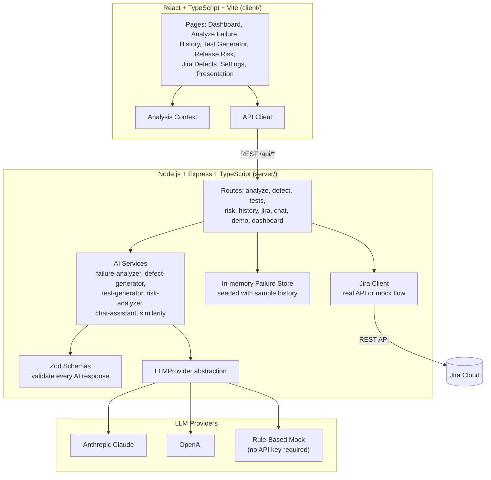
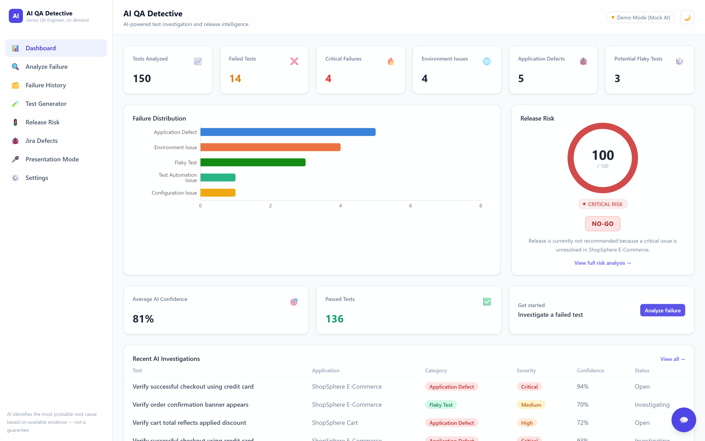
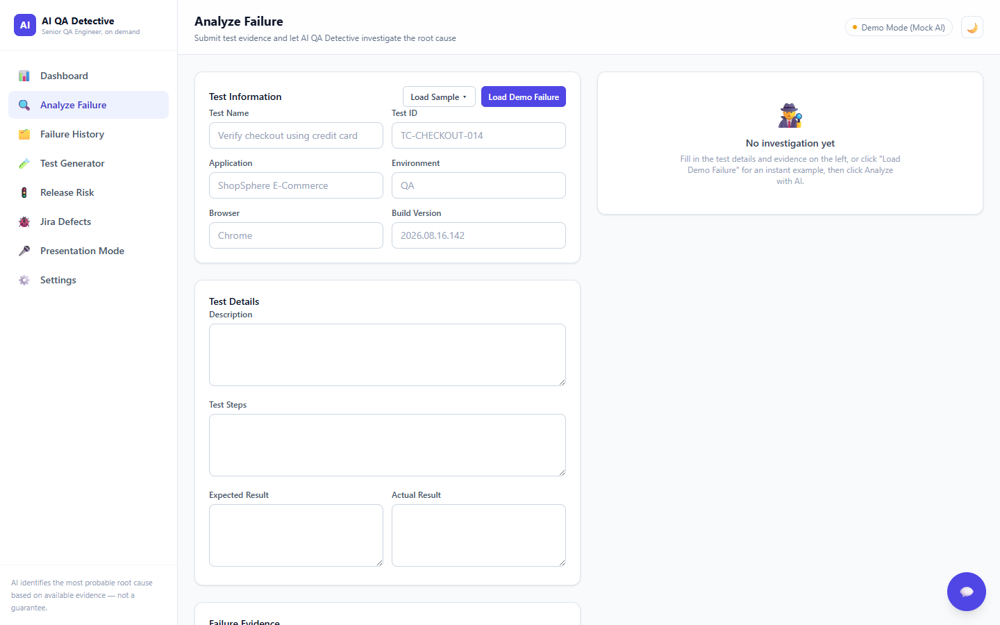
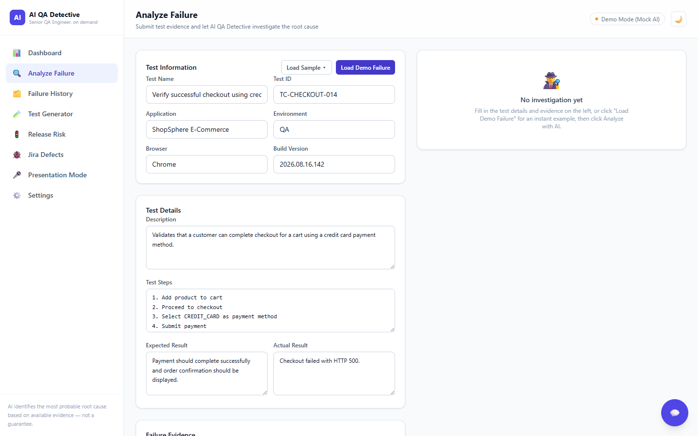
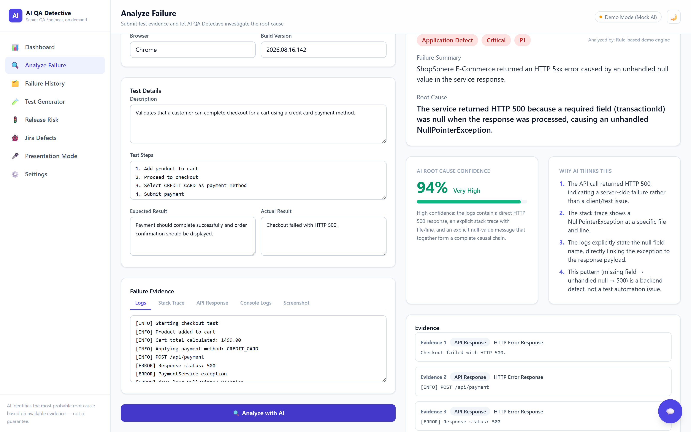
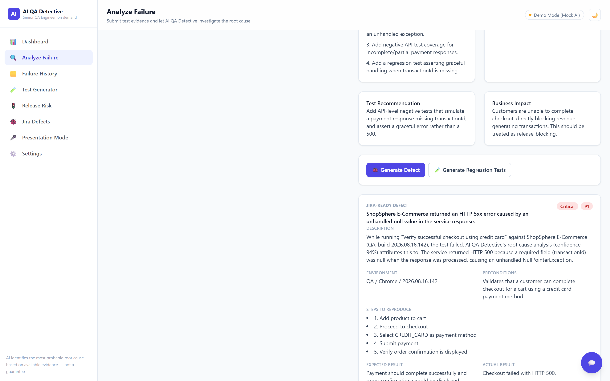
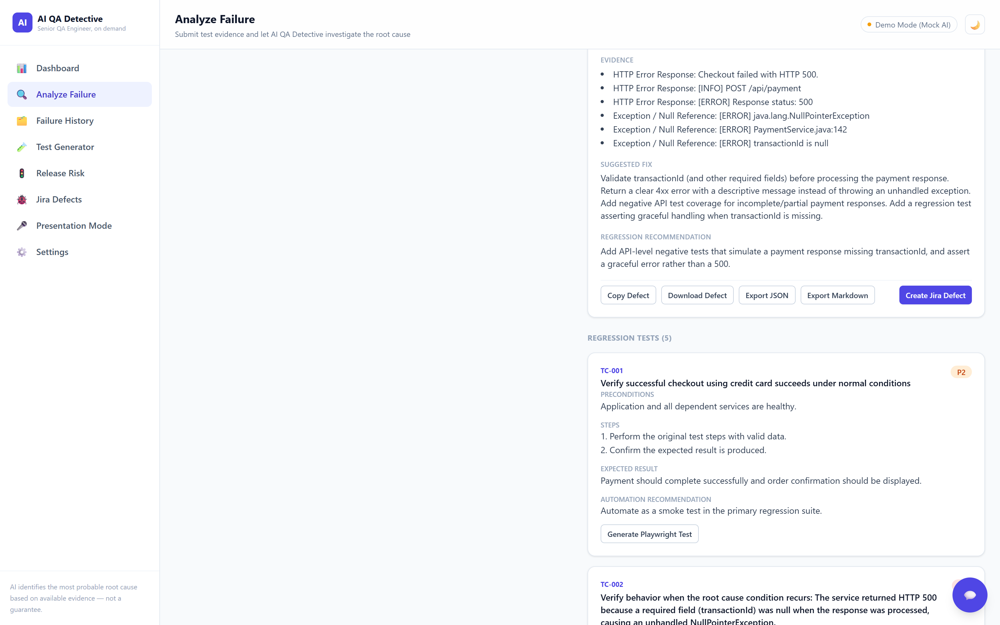
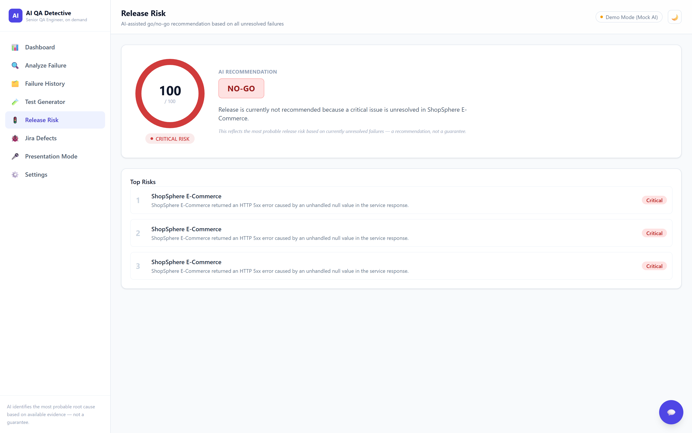
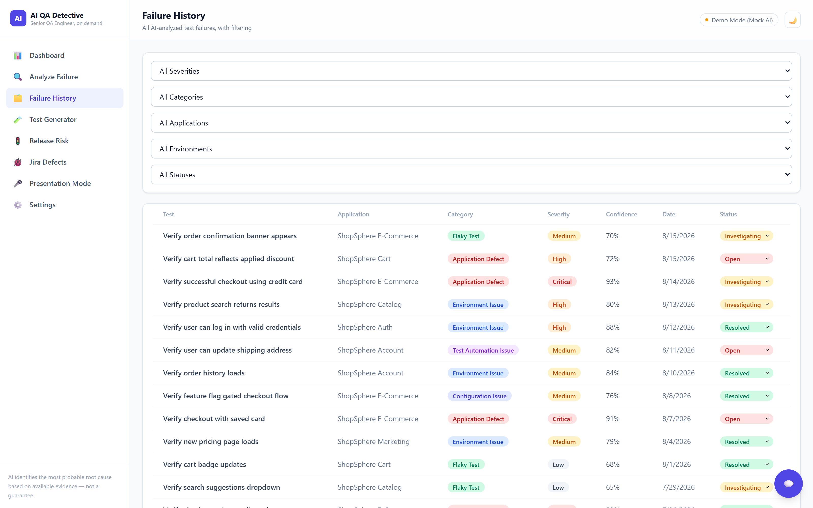
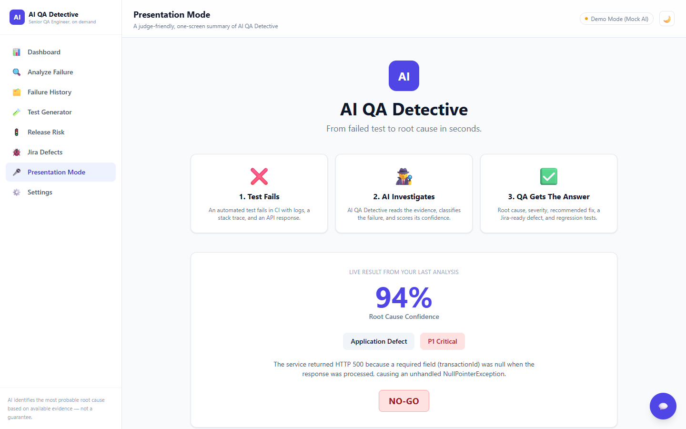

# AI QA Detective

**Your AI Senior QA Engineer for Failed Tests.**

*From failed test to root cause in seconds.*

🔗 **Live Demo: [https://ai-qa-detective-client-y1m3.vercel.app/](https://ai-qa-detective-client-y1m3.vercel.app/)**

---

## Table of Contents

1. [Problem Statement](#problem-statement)
2. [Solution](#solution)
3. [Tech Stack](#tech-stack)
4. [How to Run](#how-to-run)
5. [Demo](#demo)
6. [Screenshots](#screenshots)
7. [Additional Documentation](#additional-documentation)

---

## Problem Statement

When an automated test fails, QA engineers spend significant time reading execution logs, stack traces, screenshots, API responses, test steps, and historical failures just to figure out *why* it failed:

- Is it a real **application defect**, or a **flaky test**?
- Is it a **broken locator**, an **environment blip**, or a **configuration issue**?
- Has this exact failure happened before?
- Is it severe enough to block a release?

That triage work is repetitive, slow, and directly blocks release decisions — the same investigation gets repeated by hand every time a test fails.

## Solution

AI QA Detective automates the investigation. Give it the failure evidence (logs, stack trace, API response, console output, screenshot, expected/actual result) and it returns a **structured, evidence-backed root cause analysis** — classified, scored for confidence, and turned into a developer-ready defect and a set of regression tests. It also rolls up all open failures into a release risk score with a **GO / GO-WITH-CAUTION / NO-GO** recommendation.

The product deliberately never claims more certainty than the evidence supports:

> "AI identifies the most probable root cause based on available evidence" — not a guarantee.

Every conclusion is traced back to the specific evidence that produced it, and low-confidence analyses say so explicitly instead of guessing.

**Core features:**

- **Dashboard** — tests analyzed, failure counts by category/severity, average AI confidence, release risk gauge, recent investigations
- **Analyze Failure** — structured intake (logs, stack trace, API response, console logs, screenshot) plus a one-click "Load Demo Failure" and a live investigation animation
- **AI Root Cause Analysis** — root cause, category, severity, priority, confidence (with rationale), evidence trail, "why AI thinks this," recommended fix, developer hint, business impact
- **Failure Classification** — Application Defect / Test Automation Issue / Environment Issue / Configuration Issue / Data Issue / Flaky Test
- **AI Defect Generator** — Jira-ready defect with copy / download / export (JSON, Markdown)
- **Jira Integration** — real Jira REST API creation when credentials are configured, otherwise a clearly-labeled **simulated** flow (never claims a real ticket was made unless Jira's API confirmed it)
- **AI Test Case Generator** — regression scenarios generated from the confirmed root cause, plus on-demand Playwright test generation
- **Release Risk Analyzer** — score, risk level, top risks, and a GO/NO-GO recommendation
- **Failure History** — filterable table with per-record status updates
- **Similar Failure Detection** — comparison against history (explicitly labeled as a simplified comparison, not a trained embedding model)
- **Ask AI QA Detective** — floating chat assistant grounded in the currently analyzed failure
- **Presentation Mode** — a judge-friendly one-screen summary
- **Demo Mode** — one click loads a realistic ShopSphere checkout/payment failure end-to-end

For the full mechanism — what calls what, and the actual data at each step — see **[flow.md](flow.md)**.

## Tech Stack

**Frontend:** React 18, TypeScript, Vite, Tailwind CSS, Recharts, React Router
**Backend:** Node.js, Express, TypeScript, Zod
**AI:** Configurable `LLMProvider` abstraction — Anthropic Claude, OpenAI, or a deterministic rule-based Mock provider (no API key needed)
**Testing:** Vitest + Supertest (backend), Vitest + React Testing Library (frontend)



## How to Run

### 1. Install dependencies

```bash
npm install   # installs root, client, and server workspaces
```

### 2. Configure environment variables (optional)

Copy `.env.example` to `.env` in the repository root:

```bash
cp .env.example .env
```

| Variable | Purpose |
|---|---|
| `AI_PROVIDER` | `mock` (default, no key needed) \| `anthropic` \| `openai` |
| `ANTHROPIC_API_KEY` / `ANTHROPIC_MODEL` | Used when `AI_PROVIDER=anthropic` |
| `OPENAI_API_KEY` / `OPENAI_MODEL` | Used when `AI_PROVIDER=openai` |
| `PORT` | Server port (default `4000`) |
| `JIRA_URL`, `JIRA_PROJECT_KEY`, `JIRA_EMAIL`, `JIRA_API_TOKEN` | Optional — the Settings page also lets you configure these (stored in browser localStorage, sent per-request, never persisted server-side) |

**No API key is required to run the full demo** — with `AI_PROVIDER=mock` (the default), a deterministic, evidence-based rule engine powers every AI feature so the whole app works offline.

### 3. Run it

```bash
npm run dev
```

This starts the Express API on `http://localhost:4000` and the Vite dev server on `http://localhost:5173` (which proxies `/api` to the backend). Open **http://localhost:5173**.

Run them individually with `npm run dev:server` / `npm run dev:client`.

### 4. Build & test

```bash
npm run build   # builds server (tsc) and client (tsc + vite build)
npm run test    # runs server tests (vitest+supertest) and client tests (vitest+RTL)
```

## Demo

Try it live: **[https://ai-qa-detective-client-y1m3.vercel.app/](https://ai-qa-detective-client-y1m3.vercel.app/)** — no setup required, runs in Mock AI mode with zero API keys.

1. Open the app → **Dashboard** shows seeded metrics and release risk.
2. Go to **Analyze Failure** → click **Load Demo Failure** (a ShopSphere checkout/payment failure with HTTP 500 + NullPointerException logs is loaded instantly).
3. Click **Analyze with AI** → watch the investigation animation, then review the root cause, category (Application Defect), severity (Critical), priority (P1), ~94% confidence, evidence trail, and recommended fix.
4. Click **Generate Defect** → a Jira-ready defect appears with Copy / Download / Export actions and a **Create Jira Defect** flow (simulated unless real Jira credentials are set in Settings).
5. Click **Generate Regression Tests** → 5 regression scenarios appear, each with an optional **Generate Playwright Test** action.
6. Open **Release Risk** → score, risk level, top risks, and the NO-GO recommendation driven by the seeded + newly analyzed failures.
7. Try **Presentation Mode** for a one-screen summary suitable for a live demo audience.

The **Load Sample ▾** dropdown on Analyze Failure has 11 more scenarios beyond the flagship demo — 5 more ShopSphere ones (auth service down, API timeout, price miscalculation, flaky UI wait, broken locator; see **[docs/shopsphere/](docs/shopsphere/)**) plus 6 cross-industry ones spanning banking, warehouse logistics, ride-hailing, and healthcare (see **[test-data/](test-data/)**) — covering the full failure taxonomy, including a scenario specifically designed to test whether the AI can tell a real application defect apart from a broken test locator.

## Screenshots

| | |
|---|---|
| **Dashboard** — metrics, failure distribution, release risk |  |
| **Analyze Failure** — evidence intake form |  |
| **Load Demo Failure** — one-click ShopSphere scenario |  |
| **AI Root Cause Analysis** — confidence, evidence, "why AI thinks this" |  |
| **AI Defect Generator** — Jira-ready defect |  |
| **Regression Test Generator** |  |
| **Release Risk** — GO/NO-GO recommendation |  |
| **Failure History** — filterable table |  |
| **Presentation Mode** — judge-friendly summary |  |

## Additional Documentation

- **[flow.md](flow.md)** — a step-by-step walkthrough of the whole system with sequence/flow diagrams and real example data, for anyone new to the codebase.
- **[docs/shopsphere/](docs/shopsphere/)** — everything about ShopSphere, the fictional e-commerce app used throughout the demo/seed data: its modules, every seeded failure scenario, and how to extend it.
- **[test-data/](test-data/)** — 6 additional "Load Sample" scenarios spanning 5 different fictional companies/industries (banking, warehouse logistics, ride-hailing, healthcare), including the scenario that proves the AI can tell a real application defect apart from a broken test locator.
- **[DEPLOYMENT.md](DEPLOYMENT.md)** — step-by-step guide to deploying the frontend to Vercel and the backend to Render.
- **[PROMPT.md](PROMPT.md)** — a standalone, from-scratch specification of the entire project, detailed enough to rebuild it from an empty repo.
- **[presentation/](presentation/)** — the source for a 12-slide case-file-styled presentation deck; run `node presentation/build.mjs` to regenerate `presentation.html`.

### AI Architecture

All AI usage is centralized under `server/src/ai/`:

- `llm-provider.ts` — the `LLMProvider` interface and its three implementations (Anthropic, OpenAI, Mock). Nothing else in the codebase talks to an LLM SDK directly.
- `prompts.ts` — every system/user prompt used by the app, in one place.
- `structured-response.ts` — calls the provider, extracts JSON from the response, validates it against a Zod schema, and **retries once with a correction prompt** if parsing/validation fails; throws a typed error the routes turn into a friendly message if it still fails.
- `failure-analyzer.ts`, `defect-generator.ts`, `test-generator.ts`, `risk-analyzer.ts`, `chat-assistant.ts` — one module per feature, each with a real-LLM path (structured completion) and a deterministic mock path (`mock-analyzer.ts`) used when `AI_PROVIDER=mock`.
- `similarity.ts` — lightweight lexical/category similarity for "Similar Failure Detection," explicitly documented (and labeled in the UI) as a simplified comparison rather than a trained embedding model.

Every AI response that drives application logic is schema-validated (`server/src/schemas/index.ts`, Zod) before it ever reaches the client — the UI never renders free-form, unvalidated model output.

### Future Enhancements

- CI/CD integration (Jenkins, GitHub Actions) to auto-analyze failures straight from a pipeline run
- Direct Playwright/Selenium execution of AI-generated regression tests
- Slack notifications for critical failures and release risk changes
- Persistent database (currently in-memory, seeded on startup) with real historical trend analysis
- True embedding-based similarity search across failure history
- Autonomous re-run/verification of flaky-test hypotheses

### Limitations

- Failure history is in-memory and resets on server restart (by design, to keep the MVP simple — see `server/src/store/historyStore.ts`).
- The Mock AI provider is a deterministic rule engine, not a general-purpose LLM — it recognizes the failure signatures covered by its rules well, but a real provider (Anthropic/OpenAI) will generalize much further.
- Screenshot analysis requires a vision-capable provider (Anthropic or OpenAI); the Mock provider honestly reports it cannot analyze images.
- Similar Failure Detection uses lexical/category comparison, not trained embeddings.
- Jira integration only creates issues (no bidirectional sync); real Jira Cloud API v3 with basic auth is assumed.
