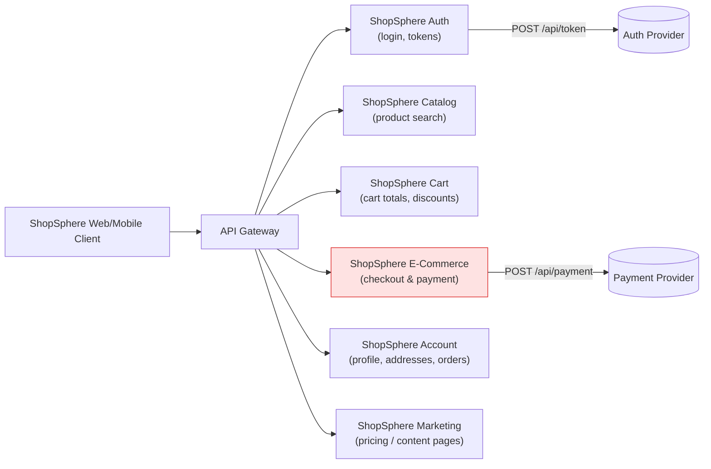

# ShopSphere — Demo Application Profile

> **ShopSphere is fictional.** It is not a real company, product, or brand. It exists only inside AI QA Detective's demo/seed data (`server/src/data/sampleFailures.ts`) so the app has a believable, consistent e-commerce system to investigate failures against. Every log line, stack trace, and API response below is synthetic — hand-authored to look like a real failure, never sourced from a real system.

This folder documents that fictional application: what it is, its modules, and every failure scenario built into the demo so you can understand (or extend) the seed data without reading the source line-by-line.

---

## Why a fictional company?

AI QA Detective's failure classification only makes sense against a system with multiple moving parts — a payment service that can throw exceptions, an auth service that can go down, a search API that can time out, a cart calculation that can be wrong, a UI that can render inconsistently, and automation that can break when the UI changes. ShopSphere exists to give each of the six failure categories (Application Defect, Environment Issue, Test Automation Issue, Configuration Issue, Data Issue, Flaky Test) a natural, realistic home — so the demo and the seeded history feel like a real product's test suite, without using any real company's data.

## ShopSphere at a glance

| | |
|---|---|
| **Product** | ShopSphere — a consumer e-commerce platform (fictional) |
| **Feature under test in the flagship demo** | Checkout & Payment |
| **Environments referenced** | `QA` (primary), `Staging` (one seeded failure) |
| **Browsers referenced** | Chrome, Firefox |
| **Build version format** | `YYYY.MM.DD.NNN`, e.g. `2026.08.16.142` |

## Modules (as they appear in the "Application" field)



The **Payment** module (highlighted) is where the flagship "Load Demo Failure" scenario lives — a NullPointerException caused by a missing `transactionId`.

| Module | `application` value | What it does | Test IDs seen in demo data |
|---|---|---|---|
| Checkout & Payment | `ShopSphere E-Commerce` | Cart checkout, payment processing, order confirmation | `TC-CHECKOUT-009`, `TC-CHECKOUT-014`, `TC-CHECKOUT-019`, `TC-CHECKOUT-031` |
| Cart | `ShopSphere Cart` | Cart totals, discount codes, cart badge | `TC-CART-027`, `TC-CART-033` |
| Catalog | `ShopSphere Catalog` | Product search and suggestions | `TC-SEARCH-011`, `TC-SEARCH-018` |
| Auth | `ShopSphere Auth` | Login and authentication tokens | `TC-AUTH-002` |
| Account | `ShopSphere Account` | User profile, shipping addresses, order history | `TC-ACCOUNT-008`, `TC-ORDERS-004` |
| Marketing | `ShopSphere Marketing` | Public-facing pricing/content pages | `TC-PRICING-002` |

---

## The flagship demo scenario

This is what loads when you click **Load Demo Failure** on the Analyze Failure page.

| Field | Value |
|---|---|
| Test | `Verify successful checkout using credit card` (`TC-CHECKOUT-014`) |
| Application | ShopSphere E-Commerce |
| Environment / Browser / Build | QA / Chrome / `2026.08.16.142` |
| Expected Result | Payment should complete successfully and order confirmation should be displayed. |
| Actual Result | Checkout failed with HTTP 500. |
| AI Root Cause | PaymentService fails to handle a missing `transactionId` from the payment response. |
| Category | Application Defect |
| Severity / Priority | Critical / P1 |
| Confidence | 94% (Very High) |

<details>
<summary>Full evidence bundle (click to expand)</summary>

**Logs:**
```
[INFO] Starting checkout test
[INFO] Product added to cart
[INFO] Cart total calculated: 1499.00
[INFO] Applying payment method: CREDIT_CARD
[INFO] POST /api/payment
[ERROR] Response status: 500
[ERROR] PaymentService exception
[ERROR] java.lang.NullPointerException
[ERROR] PaymentService.java:142
[ERROR] transactionId is null
[ERROR] Checkout failed
```

**Stack Trace:**
```
java.lang.NullPointerException: Cannot invoke "String.length()" because "transactionId" is null
    at com.shopsphere.payment.PaymentService.confirmTransaction(PaymentService.java:142)
    at com.shopsphere.payment.PaymentController.processPayment(PaymentController.java:58)
```

**API Response:**
```
POST /api/payment
Status: 500 Internal Server Error
Body: { "error": "Internal Server Error", "path": "/api/payment" }
```

**Console Logs:**
```
Uncaught (in promise) Error: Request failed with status code 500
  at handleCheckoutSubmit (checkout.tsx:88)
```

</details>

Source: `demoScenario` in [`server/src/data/sampleFailures.ts`](../../server/src/data/sampleFailures.ts).

---

## The other 5 sample scenarios (Load Sample ▾)

These cover the rest of the failure taxonomy and are available from the "Load Sample ▾" dropdown on the Analyze Failure page.

| Scenario key | Test | Application | Failure signature | Expected AI category |
|---|---|---|---|---|
| `login` | Verify user can log in with valid credentials | ShopSphere Auth | `ECONNREFUSED` to the auth host, HTTP 503 | Environment Issue |
| `productSearch` | Verify product search returns results | ShopSphere Catalog | Search request times out after 15s | Environment Issue |
| `cart` | Verify cart total reflects applied discount | ShopSphere Cart | Expected total 90.00, actual 99.00 | Application Defect (pricing) |
| `flaky` | Verify order confirmation banner appears | ShopSphere E-Commerce | Timed out waiting for `.order-confirmation-banner` | Flaky Test |
| `automation` | Verify user can update shipping address | ShopSphere Account | `NoSuchElementException` for `[data-testid='edit-address-btn']` | Test Automation Issue |

Source: `sampleScenarios` in [`server/src/data/sampleFailures.ts`](../../server/src/data/sampleFailures.ts).

---

## Seeded failure history

On server startup, 13 historical failures are pre-loaded (`seedHistory`) so the Dashboard, Failure History, Release Risk, and Similar Failure Detection features have realistic data immediately — without running a single analysis. Three of them (`PAY-142`, `PAY-098`, `PAY-051`) are recurrences of the same payment defect, specifically so the **Similar Failure Detection** feature has something to find.

| ID | Test | Application | Category | Severity | Confidence | Status | When |
|---|---|---|---|---|---|---|---|
| `PAY-142` | Verify successful checkout using credit card | ShopSphere E-Commerce | Application Defect | Critical | 93% | Investigating | 2 days ago |
| `PAY-098` | Verify checkout with saved card | ShopSphere E-Commerce | Application Defect | Critical | 91% | Open | 9 days ago |
| `PAY-051` | Verify checkout using credit card | ShopSphere E-Commerce | Application Defect | Critical | 89% | Resolved | 21 days ago |
| `CART-027` | Verify cart total reflects applied discount | ShopSphere Cart | Application Defect | High | 72% | Open | 1 day ago |
| `SRCH-011` | Verify product search returns results | ShopSphere Catalog | Environment Issue | High | 80% | Investigating | 3 days ago |
| `AUTH-002` | Verify user can log in with valid credentials | ShopSphere Auth | Environment Issue | High | 88% | Resolved | 4 days ago |
| `INFRA-014` | Verify order history loads | ShopSphere Account (Staging) | Environment Issue | Medium | 84% | Resolved | 6 days ago |
| `DEPLOY-005` | Verify new pricing page loads | ShopSphere Marketing | Environment Issue | Medium | 79% | Resolved | 12 days ago |
| `ACC-008` | Verify user can update shipping address | ShopSphere Account | Test Automation Issue | Medium | 82% | Open | 5 days ago |
| `CONF-019` | Verify feature flag gated checkout flow | ShopSphere E-Commerce | Configuration Issue | Medium | 76% | Resolved | 8 days ago |
| `FLK-019` | Verify order confirmation banner appears | ShopSphere E-Commerce | Flaky Test | Medium | 70% | Investigating | 1 day ago |
| `FLK-033` | Verify cart badge updates | ShopSphere Cart | Flaky Test | Low | 68% | Resolved | 15 days ago |
| `FLK-041` | Verify search suggestions dropdown | ShopSphere Catalog | Flaky Test | Low | 65% | Investigating | 18 days ago |

Source: `seedHistory` in [`server/src/data/sampleFailures.ts`](../../server/src/data/sampleFailures.ts). Dates are computed relative to "now" (`daysAgo(n)`), so they shift forward every time the server restarts — the relative ages above stay accurate, the absolute dates won't.

---

## Extending ShopSphere with a new scenario

To add a new fictional ShopSphere failure:

1. Add an entry to `sampleScenarios` in `server/src/data/sampleFailures.ts` with a `testInfo` / `testDetails` / `evidence` bundle that reads like a real test run.
2. If you want it recognized by the free Mock AI provider, make sure its evidence text matches one of the signatures in the `RULES` array of `server/src/ai/mock-analyzer.ts` (see [flow.md](../../flow.md) §4.2 for the full decision tree) — or add a new rule if it's a genuinely new failure pattern.
3. Optionally add a corresponding `StoredFailure` to `seedHistory` if you want it to appear in the Dashboard/History immediately on startup.
4. Update the tables in this document to keep it in sync.

For how this data flows through the app end-to-end, see **[flow.md](../../flow.md)**.
