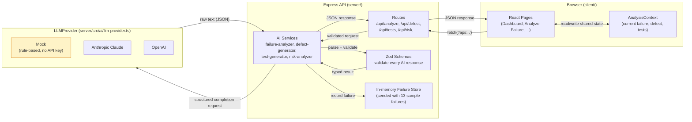
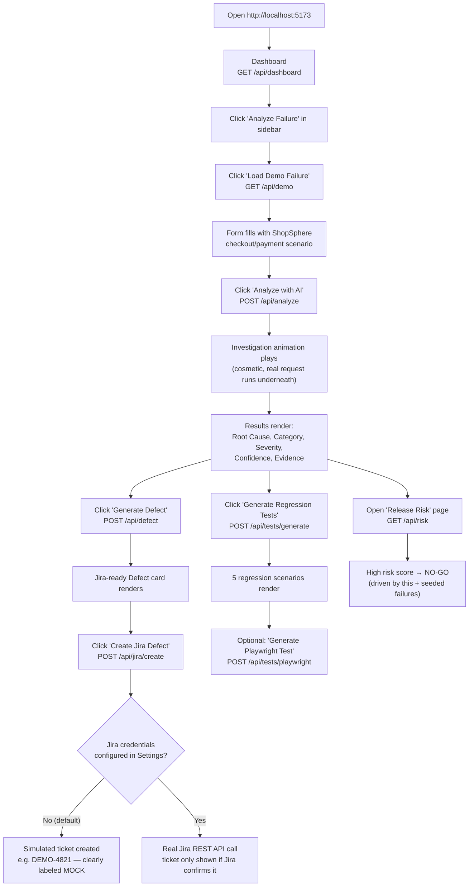
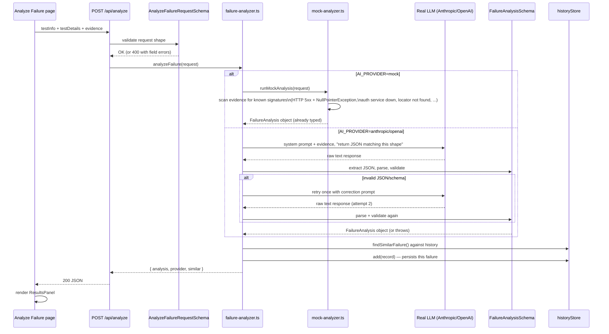
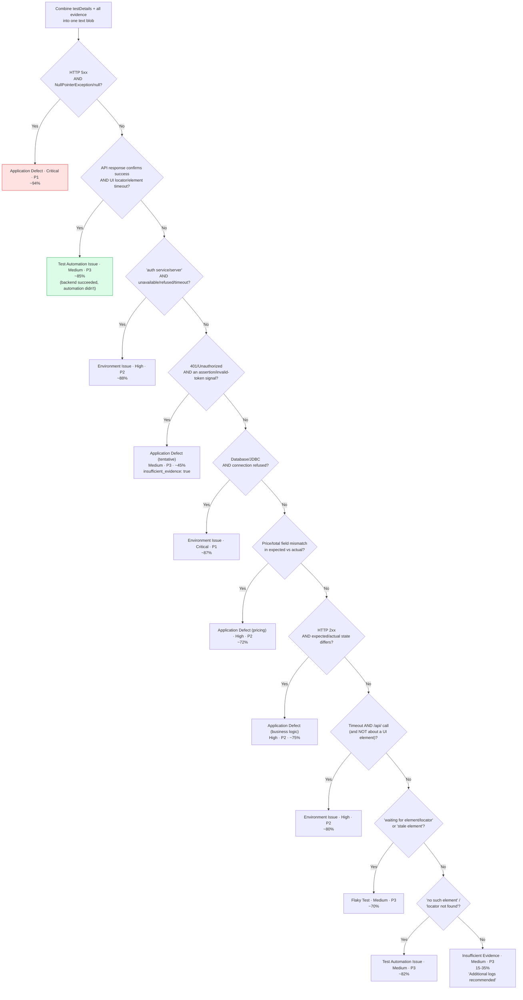
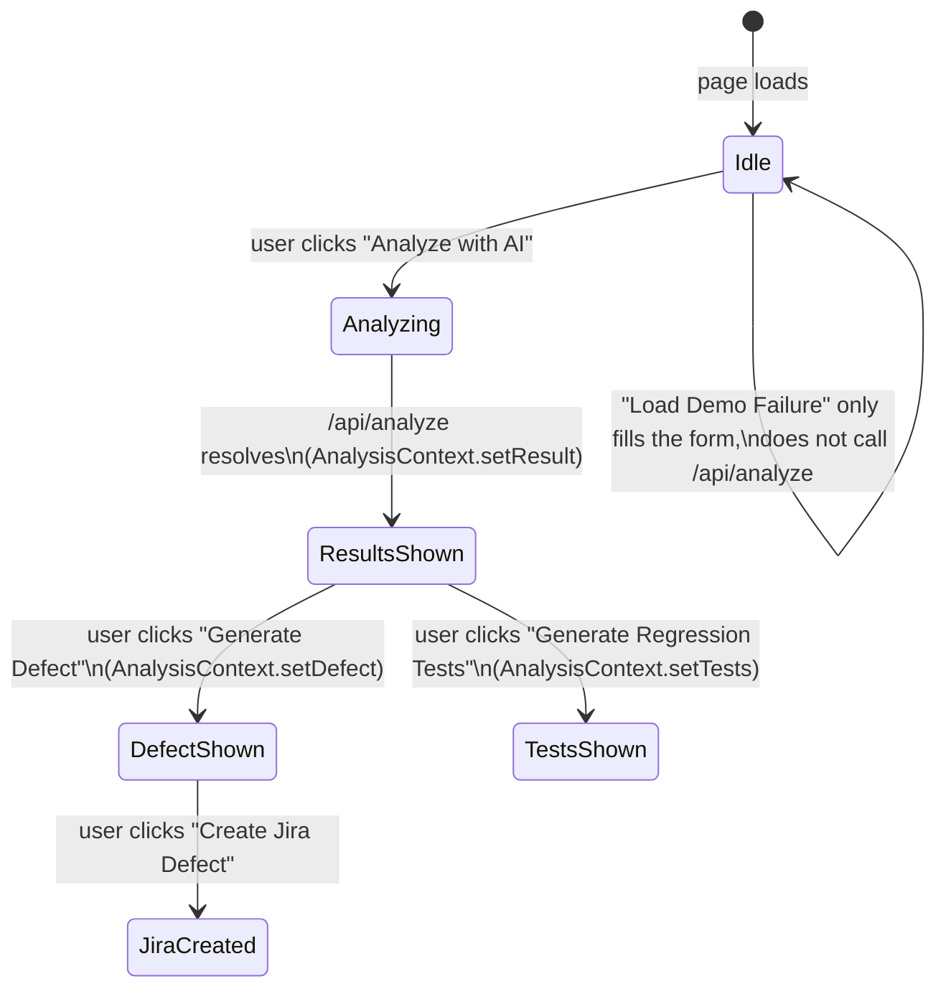
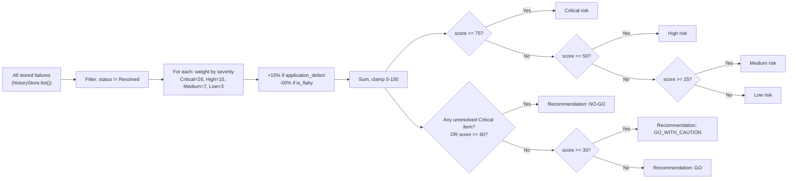

# AI QA Detective — Project Flow

This document walks a new contributor through **how the app actually works**, from a cold start to a fully analyzed failure — with the real ShopSphere demo data at each step. Read it top to bottom; each diagram builds on the one before it.

---

## 1. The big picture — what talks to what

Three layers: a React client, an Express API, and a swappable AI provider. The client never talks to an LLM directly — everything goes through the server, so API keys never reach the browser.



**Which AI branch runs is one env var:** `AI_PROVIDER=mock` (default, no key needed) routes every AI service to its deterministic rule engine; `anthropic`/`openai` route to the real SDK call instead. Nothing else in the code changes — see `server/src/ai/llm-provider.ts`.

---

## 2. The demo, step by step

This is the exact path a new user takes, and what's actually happening behind each click.



---

## 3. What happens inside `POST /api/analyze` (the core mechanism)

This is the most important request in the app. It's the same code path whether you're running the free Mock engine or a real LLM — only the branch inside "AI Service" differs.



**Why this matters for a new contributor:** the UI never sees an unvalidated AI response. If a real provider returns malformed JSON twice in a row, the route returns a 502 with a friendly message — it never crashes and never renders garbage.

---

## 4. Example run — the exact data, at every stage

Follow one real object as it moves through the system, using the built-in ShopSphere demo.

### 4.1 What the user submits (from "Load Demo Failure")

```json
{
  "testInfo": { "testName": "Verify successful checkout using credit card", "application": "ShopSphere E-Commerce", "environment": "QA" },
  "testDetails": { "expectedResult": "Payment should complete successfully.", "actualResult": "Checkout failed with HTTP 500." },
  "evidence": {
    "logs": "[ERROR] Response status: 500\n[ERROR] java.lang.NullPointerException\n[ERROR] PaymentService.java:142\n[ERROR] transactionId is null"
  }
}
```

### 4.2 How the Mock engine classifies it (`mock-analyzer.ts`)

Rules run **in this exact order** (first match wins — see the `RULES` array in `mock-analyzer.ts`). The set below was expanded to cover the cross-industry scenarios in [test-data/](../test-data/) as well as the original ShopSphere set:



Rule **R2** (checked second, right after the payment defect) is the most interesting one: it specifically requires *both* a success signal in the API response *and* a UI timeout, so it correctly attributes scenario 6 in [test-data/](../test-data/) to the automation rather than the application — proving the engine reasons about the *relationship* between evidence, not just keyword presence. See `server/tests/mock-analyzer.test.ts` for the regression tests locking in every scenario's classification.

The ShopSphere payload hits rule **R1** first (rules are checked in order, most specific first — see `RULES` array in `mock-analyzer.ts`), producing:

```json
{
  "root_cause": "PaymentService fails to handle a missing transactionId from the payment response.",
  "root_cause_category": "Application Defect",
  "severity": "Critical",
  "priority": "P1",
  "confidence": 94,
  "confidence_rationale": "High confidence: the logs contain a direct HTTP 500 response, an explicit stack trace with file/line, and an explicit null-value message that together form a complete causal chain.",
  "evidence": [
    { "label": "HTTP Error Response", "detail": "Response status: 500", "source": "log" },
    { "label": "Exception / Null Reference", "detail": "PaymentService.java:142", "source": "log" }
  ]
}
```

Every rule builds its `evidence[]` array from lines that **literally appear** in the submitted logs (via regex matches) — nothing is invented. That's the "evidence-based root cause" principle from the product spec, enforced in code, not just in the prompt.

### 4.3 What the client does with the response



`AnalysisContext` (`client/src/context/AnalysisContext.tsx`) is the one shared piece of state — it's what lets the **Test Generator**, **Jira Defects**, and the floating **chat assistant** all reference "the failure you just analyzed" without re-fetching or prop-drilling across routes.

---

## 5. Release Risk — how the dashboard number is computed



With a real LLM provider configured, this same decision is instead made by an LLM given the same failure list (`buildRiskPrompt` in `prompts.ts`) — the mock version above is what runs by default so the number is explainable and deterministic.

---

## 6. Where to look in the code for each box

| Diagram box | File |
|---|---|
| Routes | `server/src/routes/*.ts` |
| Zod schemas | `server/src/schemas/index.ts` |
| LLMProvider (mock/anthropic/openai) | `server/src/ai/llm-provider.ts` |
| Mock rule engine | `server/src/ai/mock-analyzer.ts` |
| Real-provider prompt + retry logic | `server/src/ai/prompts.ts`, `server/src/ai/structured-response.ts` |
| Failure store + seed data | `server/src/store/historyStore.ts`, `server/src/data/sampleFailures.ts` |
| Release risk logic | `server/src/ai/risk-analyzer.ts` |
| Similarity detection | `server/src/ai/similarity.ts` |
| Shared frontend state | `client/src/context/AnalysisContext.tsx` |
| API client (all `fetch` calls) | `client/src/api/client.ts` |
| Results UI | `client/src/components/ResultsPanel.tsx` |

For setup/run instructions, see [README.md](README.md).
